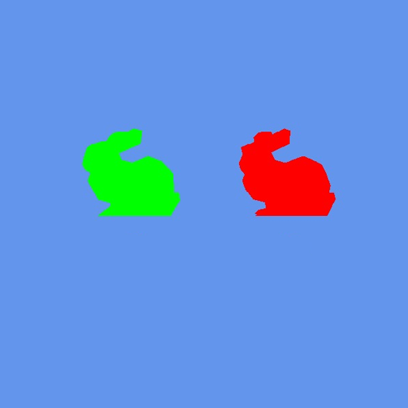

# GPUInstancing

  

## Description
When looking at the Flyweight pattern from the Game Programming Patterns book, it said something about reusing an instance of an object to reduce data stored in the game. When researching this I came upon this subject. This seemed a nice way to reduce data used.

## Code snippets
[Rendering](https://github.com/SteveVerhoeven/GPUInstancing/blob/main/VanaheimEngine/RenderComponent.cpp)

[Instance Buffer](https://github.com/SteveVerhoeven/GPUInstancing/blob/main/VanaheimEngine/RenderComponent.cpp)

[Vertex Buffers](https://github.com/SteveVerhoeven/GPUInstancing/blob/main/VanaheimEngine/RenderComponent.cpp)

[Load 3D Mesh](https://github.com/SteveVerhoeven/GPUInstancing/blob/main/VanaheimEngine/ResourceManager.cpp)

## Credits
### Introduction to Geometry Instancing
[Chapter 3. Inside Geometry Instancing](https://developer.nvidia.com/gpugems/gpugems2/part-i-geometric-complexity/chapter-3-inside-geometry-instancing)

### Instancing with index primitives
[Instancing (With Indexed Primitives)](https://www.braynzarsoft.net/viewtutorial/q16390-33-instancing-with-indexed-primitives)
